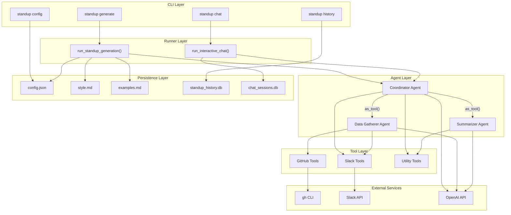
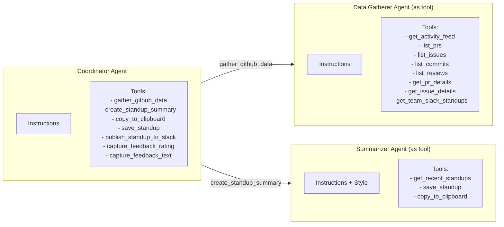
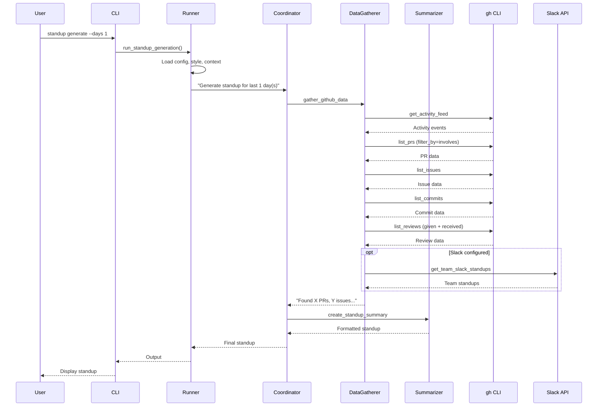
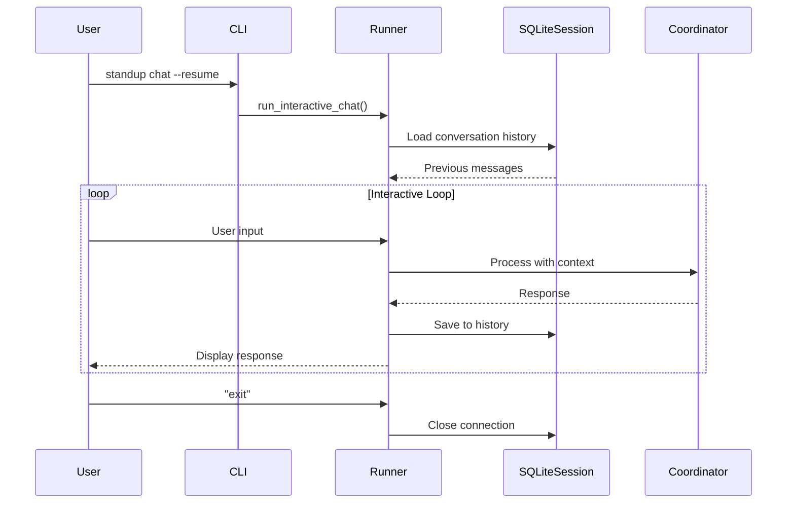
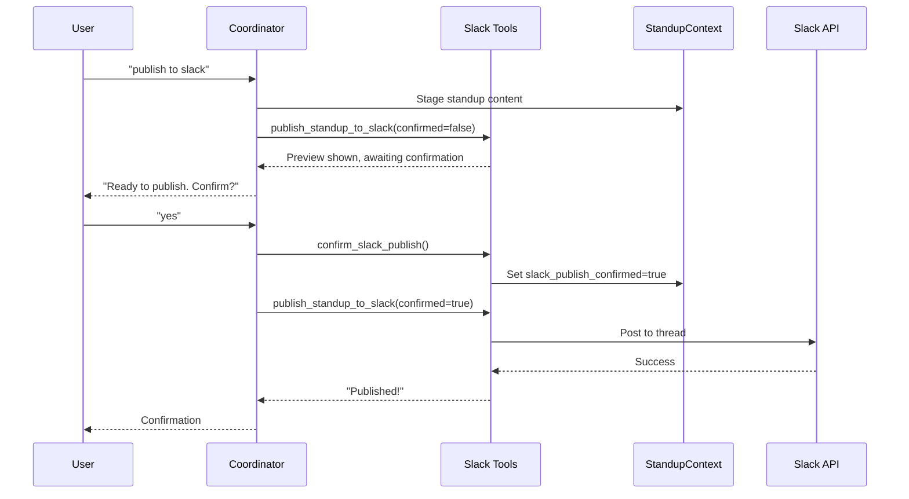
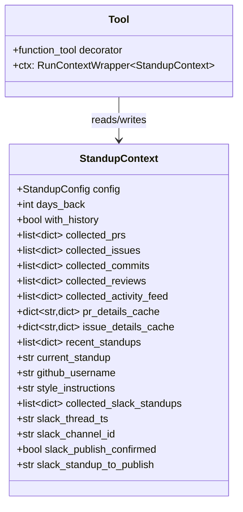
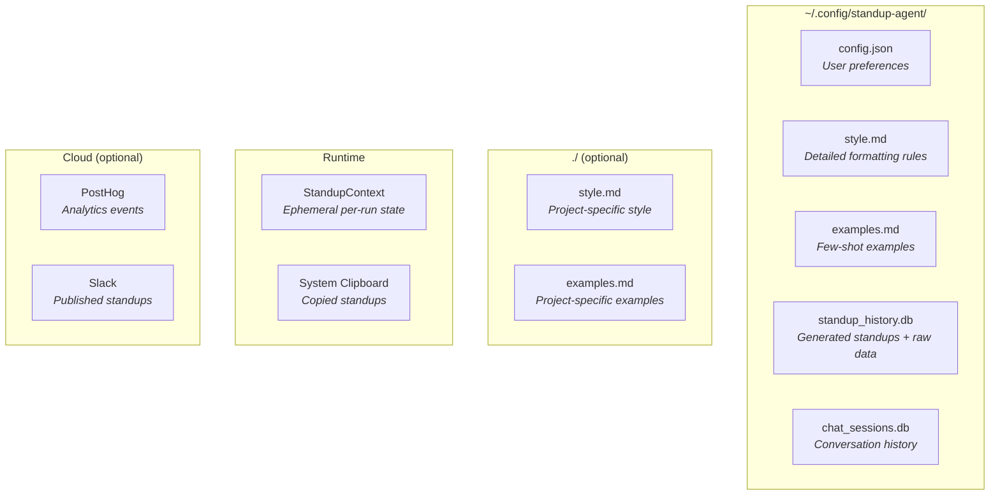
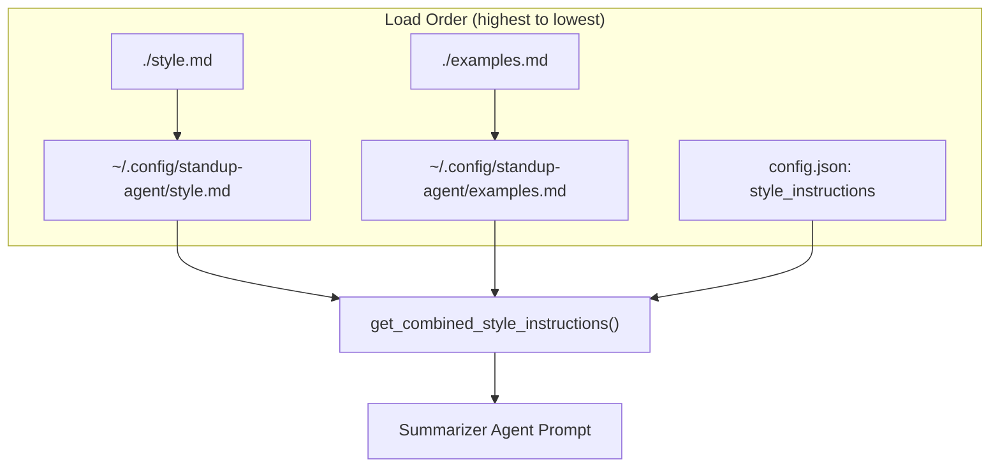

# Architecture

This document describes the architecture of the GitHub Standup Agent, a multi-agent system built with the OpenAI Agents SDK.

## High-Level Overview



## Agent Architecture

The system uses the **agents-as-tools** pattern from the OpenAI Agents SDK. Sub-agents are wrapped as tools and invoked by the coordinator.



### Agent Responsibilities

| Agent | Model | Temperature | Responsibility |
|-------|-------|-------------|----------------|
| **Coordinator** | gpt-5.2 | 0.5 | Orchestrates workflow, handles user commands |
| **Data Gatherer** | gpt-5.2 | 0.3 | Collects GitHub activity via `gh` CLI |
| **Summarizer** | gpt-5.2 | 0.7 | Creates human-readable standup summaries |

## Data Flow

### Generate Mode



### Chat Mode



### Slack Publish Flow



## Context & State

### StandupContext (Runtime State)

The `StandupContext` dataclass is passed through all agents and tools via `RunContextWrapper`. It holds transient per-run state (not persisted between runs).



### Persistence Layer



### Storage Summary

| Storage | File | Persisted | Purpose |
|---------|------|-----------|---------|
| **Config** | `config.json` | Yes | User preferences (model, channel, etc.) |
| **Style** | `style.md` | Yes | Detailed standup formatting instructions |
| **Examples** | `examples.md` | Yes | Few-shot prompting examples |
| **History DB** | `standup_history.db` | Yes | Generated standups + raw GitHub data |
| **Sessions DB** | `chat_sessions.db` | Yes | Chat conversation history (SDK managed) |
| **Context** | In-memory | No | Per-run state shared between agents/tools |
| **Clipboard** | System | No | Temporary standup copy |
| **PostHog** | Cloud | Yes | Usage analytics (opt-in) |
| **Slack** | Cloud | Yes | Published standups in threads |

## Tool Inventory

### GitHub Tools (Data Gatherer)

Tools are organized in `tools/github/` with a two-tier pattern: overview/list tools for discovery, detail tools for drill-down.

| Tool | File | Description |
|------|------|-------------|
| `get_activity_feed` | `tools/github/github_events.py` | Chronological feed of all activity (start here) |
| `get_activity_summary` | `tools/github/github_activity.py` | Aggregate contribution statistics |
| `list_prs` | `tools/github/github_prs.py` | Search PRs with flexible filters (authored/reviewed/assigned/involves) |
| `list_issues` | `tools/github/github_issues.py` | Search issues with flexible filters |
| `list_commits` | `tools/github/github_commits.py` | Search commits by user |
| `list_reviews` | `tools/github/github_reviews.py` | Fetch reviews given or received with actual states |
| `get_pr_details` | `tools/github/github_prs.py` | Full PR context (body, reviews, CI, linked issues) |
| `get_issue_details` | `tools/github/github_issues.py` | Full issue context (body, linked PRs, labels) |

### Slack Tools

Tools are organized in `tools/slack/`.

| Tool | File | Description |
|------|------|-------------|
| `get_team_slack_standups` | `tools/slack/slack_standups.py` | Read team standup threads |
| `publish_standup_to_slack` | `tools/slack/slack_publish.py` | Post standup to thread |
| `confirm_slack_publish` | `tools/slack/slack_publish.py` | Set confirmation flag |

### Utility Tools

| Tool | File | Description |
|------|------|-------------|
| `copy_to_clipboard` | `tools/clipboard.py` | Copy standup to clipboard |
| `get_recent_standups` | `tools/history.py` | Fetch from history DB |
| `save_standup` | `tools/history.py` | Save to history DB |
| `save_standup_to_file` | `tools/history.py` | Export to markdown file |

### Feedback Tools

| Tool | File | Description |
|------|------|-------------|
| `capture_feedback_rating` | `tools/feedback.py` | Capture thumbs up/down rating |
| `capture_feedback_text` | `tools/feedback.py` | Capture detailed text feedback |

## Guardrails

The system includes input/output guardrails for validation:

| Guardrail | Type | Purpose |
|-----------|------|---------|
| `validate_days_guardrail` | Input | Limits `days_back` to reasonable range |
| `pii_check_guardrail` | Output | Checks for PII in generated content |

## Configuration Hierarchy

Style and examples are loaded with the following priority:



## Observability

### Hooks

The system uses the OpenAI Agents SDK hooks for logging:

- **`StandupRunHooks`**: Run-level events (start, end, tool calls)
- **`StandupAgentHooks`**: Agent-level events (for verbose mode)

### PostHog Integration (Optional)

When `POSTHOG_API_KEY` is set:

| Event | When | Properties |
|-------|------|------------|
| `standup_generated` | After every generation | summary, username, days_back, metadata |
| `standup_saved` | When explicitly saved | Same as above |
| `$ai_metric` | User gives thumbs up/down | trace_id, metric_name, metric_value, comment |
| `$ai_feedback` | User gives text feedback | trace_id, feedback_text |

## Directory Structure

```
src/github_standup_agent/
├── cli.py                 # Typer CLI entry point
├── runner.py              # Agent execution (generate/chat modes)
├── context.py             # StandupContext dataclass
├── config.py              # Configuration loading/saving
├── db.py                  # SQLite history database
├── hooks.py               # Run/Agent hooks for logging
├── instrumentation.py     # PostHog integration
├── agents/
│   ├── coordinator.py     # Main orchestrator agent
│   ├── data_gatherer.py   # GitHub data collection agent
│   └── summarizer.py      # Summary generation agent
├── tools/
│   ├── __init__.py        # Re-exports all tools
│   ├── clipboard.py       # System clipboard
│   ├── history.py         # History DB tools
│   ├── feedback.py        # Feedback capture tools
│   ├── github/            # GitHub CLI wrappers
│   │   ├── github_activity.py   # get_activity_summary
│   │   ├── github_events.py     # get_activity_feed
│   │   ├── github_prs.py        # list_prs, get_pr_details
│   │   ├── github_issues.py     # list_issues, get_issue_details
│   │   ├── github_commits.py    # list_commits
│   │   └── github_reviews.py    # list_reviews
│   └── slack/             # Slack API tools
│       ├── slack_client.py      # Slack API client
│       ├── slack_standups.py    # get_team_slack_standups
│       └── slack_publish.py     # publish_standup_to_slack
└── guardrails/
    ├── input_guardrails.py
    └── output_guardrails.py
```

## Key Design Decisions

1. **Agents-as-Tools Pattern**: Sub-agents are invoked as tools rather than handoffs for more reliable execution flow.

2. **Context Passing**: `StandupContext` is passed via `RunContextWrapper`, keeping state out of the LLM but accessible to all tools.

3. **Two-Step Slack Publish**: Requires explicit user confirmation before publishing to prevent accidental posts.

4. **Style Priority**: Local project files override global config, allowing per-repo customization.

5. **Dual Database Design**:
   - `standup_history.db`: Custom schema for standups + raw data (app-managed)
   - `chat_sessions.db`: SDK-managed conversation persistence

## Open Questions

- **Is `standup_history.db` still needed?** With Slack integration, standups now live in Slack threads. The local DB provides offline access and raw data storage, but may be redundant for users who publish to Slack.
